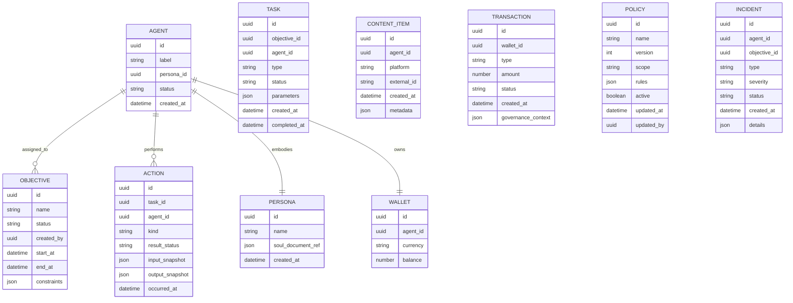

Here’s a complete draft you can paste into `specs/technical.md`.

```markdown
# Project Chimera — Technical Specification

> This document defines key **API contracts**, **data model / ERD**, and the **technical boundaries between Agents, Skills, and MCP**.  
> It is derived from `_meta.md` and `functional.md` and intentionally omits concrete implementation details (e.g., specific databases, transports, or frameworks).

---

## 1. External Orchestrator APIs

> These APIs are consumed by **operator-facing tools** (e.g., console, automation) — **not by Agents directly**.  
> (Assumption: Transport is HTTP+JSON or equivalent, but contracts are specified in logical JSON only.)

### 1.1 Create or Update Objective

**Intent**: Define or modify a campaign-like objective for one or more Agents.

**Request (Create)**

```json
POST /objectives
{
  "name": "Increase engagement for Persona X in Region Y",
  "description": "Grow weekly engagement by 20% over 30 days",
  "target_persona_id": "persona-uuid",
  "target_agents": ["agent-uuid-1", "agent-uuid-2"],
  "time_horizon": {
    "start": "2025-01-01T00:00:00Z",
    "end": "2025-01-31T23:59:59Z"
  },
  "constraints": {
    "max_daily_budget": 100.0,
    "disallowed_content_categories": ["politics", "adult"],
    "regions": ["US", "CA"]
  },
  "risk_profile": "standard",
  "created_by": "human-operator-id"
}
```

**Response**

```json
201 Created
{
  "objective_id": "objective-uuid",
  "status": "active",
  "created_at": "2025-01-01T00:00:00Z"
}
```

**Request (Update)**

```json
PATCH /objectives/{objective_id}
{
  "name": "Increase engagement for Persona X in Region Y (Phase 2)",
  "constraints": {
    "max_daily_budget": 150.0
  },
  "risk_profile": "elevated",
  "updated_by": "human-operator-id"
}
```

**Response**

```json
200 OK
{
  "objective_id": "objective-uuid",
  "status": "active",
  "updated_at": "2025-01-10T12:00:00Z"
}
```

(Assumption: Objectives are high-level, long-running intents that the Orchestrator decomposes into tasks for Agents.)

---

### 1.2 Get Objective Status

**Intent**: Allow operators and monitoring systems to understand progress and risk on objectives.

**Request**

```json
GET /objectives/{objective_id}
```

**Response**

```json
200 OK
{
  "objective_id": "objective-uuid",
  "name": "Increase engagement for Persona X in Region Y",
  "status": "active",
  "progress": {
    "completion_percent": 42.5,
    "key_metrics": {
      "engagement_delta_percent": 15.2,
      "content_items_published": 27
    }
  },
  "risk_state": {
    "current_level": "elevated",
    "recent_incidents": [
      {
        "incident_id": "incident-uuid",
        "type": "content_review_required",
        "status": "open"
      }
    ]
  },
  "assigned_agents": [
    {
      "agent_id": "agent-uuid-1",
      "status": "active",
      "last_heartbeat": "2025-01-10T11:59:00Z"
    }
  ],
  "time_horizon": {
    "start": "2025-01-01T00:00:00Z",
    "end": "2025-01-31T23:59:59Z"
  }
}
```

(Assumption: Progress is expressed via high-level metrics, not raw logs.)

---

### 1.3 Governance Policy Management

**Intent**: Let Human Reviewers tune governance while preserving auditability.

**Request (Get Policy)**

```json
GET /policies/{policy_id}
```

**Response**

```json
200 OK
{
  "policy_id": "policy-uuid",
  "name": "Default influencer safety policy",
  "version": 3,
  "scope": "global",
  "rules": {
    "max_daily_spend_per_agent": 100.0,
    "high_risk_content_categories": ["politics", "health_misinformation"],
    "auto_escalate_content_flags": ["children", "self_harm"]
  },
  "active": true,
  "updated_at": "2025-01-05T15:00:00Z",
  "updated_by": "human-operator-id"
}
```

**Request (Update Policy)**

```json
PATCH /policies/{policy_id}
{
  "rules": {
    "max_daily_spend_per_agent": 80.0
  },
  "updated_by": "human-operator-id",
  "change_reason": "Tightening spend after budget review"
}
```

**Response**

```json
200 OK
{
  "policy_id": "policy-uuid",
  "version": 4,
  "updated_at": "2025-01-10T09:30:00Z"
}
```

(Assumption: Policies are logical documents; underlying storage and propagation are implementation details.)

---

## 2. Agent–Skill Interaction Contracts

> These contracts describe the **logical JSON shape** of calls between Agents and Skills.  
> (Assumption: In practice, these map onto MCP tool requests/responses, but transport details are abstracted.)

### 2.1 Generic Skill Invocation Envelope

**Agent → Skill Request**

```json
{
  "invocation_id": "invocation-uuid",
  "agent_id": "agent-uuid",
  "skill_name": "skill_fetch_trends",
  "intent": "understand_current_trends_for_persona_context",
  "input": {
    // skill-specific payload
  },
  "context": {
    "persona_id": "persona-uuid",
    "objective_id": "objective-uuid",
    "risk_profile": "standard",
    "trace_id": "trace-uuid"
  }
}
```

**Skill → Agent Response**

```json
{
  "invocation_id": "invocation-uuid",
  "skill_name": "skill_fetch_trends",
  "status": "success",
  "output": {
    // skill-specific result
  },
  "meta": {
    "duration_ms": 1234,
    "warnings": [],
    "trace_id": "trace-uuid"
  }
}
```

On failure:

```json
{
  "invocation_id": "invocation-uuid",
  "skill_name": "skill_fetch_trends",
  "status": "failure",
  "error": {
    "code": "UPSTREAM_TIMEOUT",
    "message": "Trend service did not respond in time",
    "retryable": true
  },
  "meta": {
    "duration_ms": 30010,
    "trace_id": "trace-uuid"
  }
}
```

(Assumption: Determinism is defined conditional on `input` + `context`; `trace_id` is for observability, not logic.)

---

### 2.2 `skill_fetch_trends` Contract

**Input**

```json
{
  "platform": "tiktok",
  "region": "US",
  "limit": 20,
  "persona_topic_filters": ["fitness", "wellness"]
}
```

**Output**

```json
{
  "trends": [
    {
      "topic": "home workout challenges",
      "score": 0.87,
      "timestamp": "2025-01-10T11:58:00Z",
      "examples": [
        {
          "content_id": "external-content-id-1",
          "title": "7-day core challenge",
          "url": "https://platform.example/trend/123"
        }
      ]
    }
  ],
  "source": {
    "platform": "tiktok",
    "region": "US",
    "retrieved_at": "2025-01-10T12:00:00Z"
  }
}
```

(Assumption: This skill is read-only and does not create or modify content or financial state.)

---

### 2.3 `skill_generate_content` Contract

**Input**

```json
{
  "persona_id": "persona-uuid",
  "objective_id": "objective-uuid",
  "content_goal": "promote a 7-day core challenge in a friendly, motivational tone",
  "target_platform": "tiktok",
  "constraints": {
    "max_length_chars": 2200,
    "disallowed_phrases": ["guaranteed results"],
    "tone": "supportive"
  }
}
```

**Output**

```json
{
  "draft_content": {
    "text": "Hey team, ready to level up your core? ...",
    "hashtags": ["#CoreChallenge", "#HomeWorkout"],
    "call_to_action": "Join the 7-day challenge and tag your progress."
  },
  "safety_assessment": {
    "risk_level": "low",
    "flags": []
  }
}
```

(Assumption: Skill returns **drafts** only; decisions to publish go through separate review logic and/or `skill_publish_status`.)

---

### 2.4 `skill_publish_status` Contract

**Input**

```json
{
  "agent_id": "agent-uuid",
  "persona_id": "persona-uuid",
  "platform": "tiktok",
  "draft_id": "draft-uuid",
  "content": {
    "text": "Hey team, ready to level up your core? ...",
    "hashtags": ["#CoreChallenge", "#HomeWorkout"]
  },
  "governance_context": {
    "objective_id": "objective-uuid",
    "policy_version": 4,
    "requires_human_approval": true,
    "approval_reference": "approval-uuid"
  }
}
```

**Output**

```json
{
  "publish_status": "published",
  "external_post_id": "platform-post-id",
  "published_at": "2025-01-10T12:05:00Z",
  "audit": {
    "policy_version": 4,
    "approved_by": "human-operator-id",
    "approval_reference": "approval-uuid"
  }
}
```

On rejection:

```json
{
  "publish_status": "rejected",
  "reason": "Human reviewer rejected draft due to claim strength",
  "recommendations": [
    "Remove absolute guarantees about results",
    "Add timeframe disclaimers"
  ]
}
```

(Assumption: Human approval may be embedded in `governance_context` rather than handled by this skill directly.)

---

## 3. MCP Server Contracts (High-Level)

> MCP servers are the **only bridge** to external systems (platform APIs, data stores).  
> Skills may call MCP; Agents may not.

### 3.1 Generic MCP Tool Request/Response

**Request**

```json
{
  "tool_name": "trend_fetch_api",
  "arguments": {
    "platform": "tiktok",
    "region": "US",
    "limit": 20
  }
}
```

**Response (Success)**

```json
{
  "ok": true,
  "result": {
    "trends": [
      {
        "topic": "home workout challenges",
        "score": 0.87,
        "timestamp": "2025-01-10T11:58:00Z"
      }
    ]
  }
}
```

**Response (Failure)**

```json
{
  "ok": false,
  "error": {
    "code": "RATE_LIMIT",
    "message": "Too many requests to trend endpoint"
  }
}
```

(Assumption: Each MCP server/tool has its own more detailed schema, but they all conform to this envelope.)

---

## 4. Data Model and ERD

> The ERD is **conceptual** and does not mandate any particular storage technology.  
> Types (`uuid`, `string`, `datetime`, `json`) are logical, not bound to a specific DB.



(Assumptions:  
- `TASK` represents internal work units derived from `OBJECTIVE`.  
- `ACTION` captures discrete side-effecting or evaluable steps (e.g., a specific publish attempt or trend fetch) with input/output snapshots for auditability.  
- `CONTENT_ITEM` is a logical representation of external posts or artifacts.  
- `POLICY` and `INCIDENT` support governance and post-hoc analysis as per `functional.md`.)

---

## 5. Explicit Boundaries: Agents, Skills, MCP

### 5.1 Call Graph and Responsibilities

- **Agents**
  - Decide **what they want to do next** within their objectives and persona constraints.
  - May **only request capabilities via Skills** using the generic invocation envelope.
  - **Never** call MCP tools, external APIs, or databases directly.

- **Skills**
  - Provide **deterministic, contract-first capabilities** to Agents.
  - May call MCP tools and internal services required to implement their contracts.
  - Must surface **all meaningful effects and decisions** via their JSON outputs (no hidden side channels).

- **MCP Servers**
  - Provide **controlled, audited access** to external systems.
  - Are not directly visible to Agents; only Skills and Orchestrator components may call them.

(Assumption: Orchestrator components may also call MCP directly for fleet-level operations, but still respect the same logging and governance rules.)

---

### 5.2 Data and Side-Effect Boundaries

- **Agents**
  - May read/write only:
    - Their own **logical state** (goals, ephemeral planning context),
    - Their assigned **long-term memory** through governed mechanisms.
  - May not mutate:
    - Global governance data,
    - Other Agents’ internal state,
    - External systems.

- **Skills**
  - May produce side effects **only as defined in their contracts** (e.g., publishing content, creating transactions).
  - When writing to databases or external platforms via MCP:
    - Must ensure actions are **represented as `ACTION`, `CONTENT_ITEM`, or `TRANSACTION` records** with sufficient context for audit.
  - Must not maintain **undeclared persistent state** that affects behavior across calls.

- **MCP**
  - Acts as the **only** layer where actual external side effects occur.
  - Must log enough context (e.g., `trace_id`, `agent_id` through skill context) to be reconstructable from system records.

---

### 5.3 Determinism and State

- **Determinism**
  - For a given `input` + `context`, a Skill must:
    - Return the **same structured output**, or
    - Return a **structured failure** (e.g., rate limit, upstream error).
  - Any dependence on time or external mutable state must:
    - Be **explicit** in the input (e.g., “as of timestamp X”), or
    - Be reflected in the output metadata in a way that supports replay and explanation.

- **State**
  - Long-term state relevant to Agents (e.g., memory, wallets, policy versions) resides in the **shared data model** (e.g., `AGENT`, `WALLET`, `POLICY`).
  - Skills are **logically stateless between invocations**; any need for persistence is expressed via:
    - Writes to the shared data model, or
    - Use of external systems via MCP with corresponding records in `ACTION` / `TRANSACTION` / `CONTENT_ITEM`.

(Assumption: This model is sufficient to support the auditability and safety requirements defined in `_meta.md` and the user stories in `functional.md` without over-constraining specific implementation choices.)
```